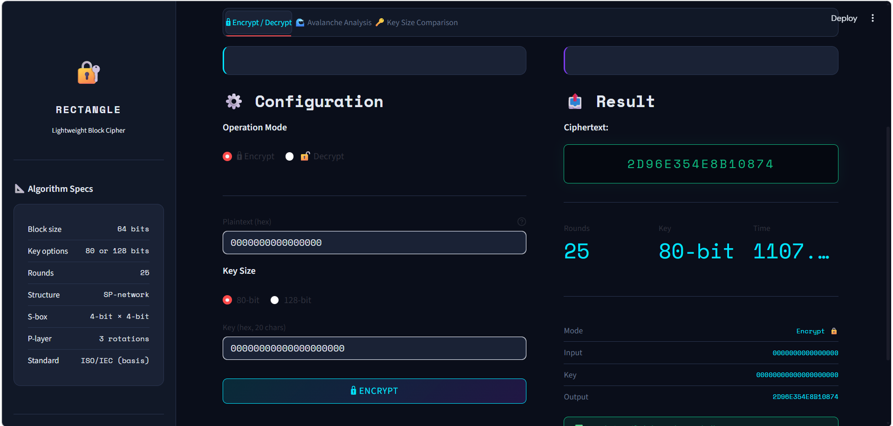
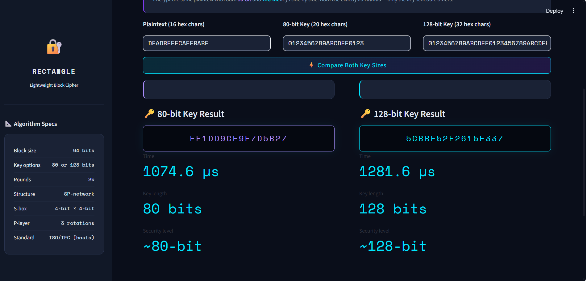
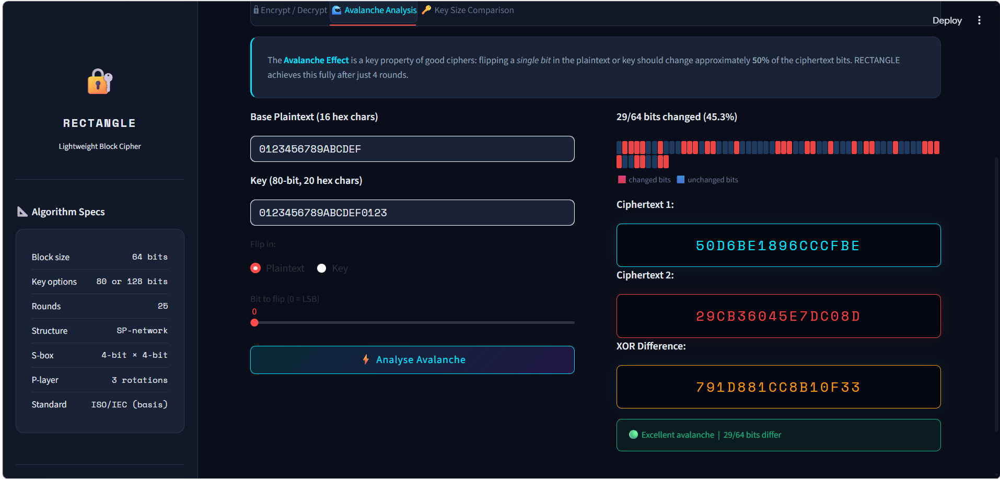

# 🔐 RECTANGLE — Lightweight Block Cipher

A complete Python implementation of the **RECTANGLE** lightweight block cipher with an interactive Streamlit web application for encryption, decryption, and security analysis.

> Developed as part of the Internet of Things & Network Security (IoTNS) course  
> Lebanese University — Faculty of Engineering Branch I  
> Academic Year 2025–2026

---

## What is RECTANGLE?

RECTANGLE is a lightweight block cipher published in 2014, designed for constrained environments like IoT sensors and RFID tags. Its key innovation is a **bit-slice architecture**: the 64-bit state is arranged as a 4 × 16 grid, allowing all 16 columns to be processed simultaneously — making it fast in software and extremely cheap in hardware (~1600 gate equivalents).

| Property       | Value                           |
|----------------|---------------------------------|
| Block size     | 64 bits                         |
| Key sizes      | 80-bit or 128-bit               |
| Rounds         | 25                              |
| Structure      | SP-network (Sub–Perm)           |
| Hardware cost  | ~1600 GE, 3.0 pJ/bit            |
| Software speed | 30.5 cycles/byte (Intel Core i5)|

---

## Application Overview

The Streamlit app has **3 tabs** and an always-visible **sidebar**.

### Sidebar
Displays algorithm specs, a step-by-step usage guide, and all 4 official test vectors ready to copy-paste.

---

### Tab 1 — Encrypt / Decrypt

> Enter a 64-bit plaintext and key in hex, choose a mode, and run.



- Supports both 80-bit and 128-bit keys
- Shows the result with execution time in µs
- Automatically verifies the round-trip: `decrypt(encrypt(PT)) == PT`

---

### Tab 2 — Avalanche Analysis

> Flip a single bit and watch ~50% of the ciphertext change.



- Flip any bit (0–63) in the plaintext or the key
- Colour-coded bit bar shows exactly which ciphertext bits changed
- Displays both ciphertexts, XOR difference, and a quality rating

---

### Tab 3 — Key Size Comparison

> Encrypt the same plaintext with an 80-bit and a 128-bit key side by side.



- Compares outputs, timing, and security levels
- Shows how many bits differ between the two ciphertexts

---

## Getting Started

```bash
pip install streamlit
streamlit run rectangle_app.py
```

---

## Project Structure

```
├── rectangle_cipher.py   # Cipher engine — all functions, test vectors, docs
├── rectangle_app.py      # Streamlit interactive web application
└── README.md
```

---

## Implementation

### State Representation

The 64-bit plaintext is not treated as a single word. It is laid out as a **4 × 16 rectangular array** — 4 rows of 16 bits each:

```
State = [ Row0, Row1, Row2, Row3 ]   (each row = 16-bit integer)

Row0 = bits 48..63  (most significant)
Row3 = bits  0..15  (least significant)
```

Each column `j` (0 ≤ j ≤ 15) is the 4-bit value formed by taking bit `j` from every row — this column is what gets fed into the S-box.

---

### Round Operations

Every round performs three operations in order:

#### 1. `add_round_key(state, subkey)`
Simple XOR of each row with the corresponding 16-bit subkey word. XOR is its own inverse, so the same function is used in both encryption and decryption.

```python
return [state[i] ^ subkey[i] for i in range(4)]
```

#### 2. `sub_column(state)`
Applies the 4-bit S-box to each of the 16 columns independently (confusion step). For each column `j`, bit `j` is extracted from every row to form a 4-bit value, substituted through the S-box, then scattered back.

```
SBOX = [6, 5, C, A, 1, E, 7, 9, B, 0, 3, D, 8, F, 4, 2]
```

The S-box has no fixed points, a maximum differential probability of 2⁻², and was selected from thousands of candidates to minimise trail clustering.

#### 3. `shift_row(state)`
Left-rotates each 16-bit row by a fixed offset (diffusion step):

| Row  | Rotation |
|------|----------|
| Row0 | 0 bits   |
| Row1 | 1 bit    |
| Row2 | 12 bits  |
| Row3 | 13 bits  |

These asymmetric offsets guarantee full diffusion after just 4 rounds. In hardware this is pure wiring — zero gate cost.

---

### Key Schedule

#### 80-bit version — `key_schedule_80(master_key)`
The 80-bit key is stored as five 16-bit rows `[Row0 .. Row4]`. Each round:

1. Extract subkey: `SK_r = [Row0, Row1, Row2, Row3]`
2. Apply S-box to the 4 rightmost columns of rows 0–3
3. Feistel mixing:
```
Row0' = (Row0 <<< 8)  XOR Row1
Row1' = Row2
Row2' = Row3
Row3' = (Row3 <<< 12) XOR Row4
Row4' = Row0
```
4. XOR round constant `RC[r]` into the lowest 5 bits of `Row0`

#### 128-bit version — `key_schedule_128(master_key)`
Same structure but uses four 32-bit rows, applies the S-box to 8 columns, and uses rotations of 8 and 16 bits.

---

### Encrypt / Decrypt

```python
# Encrypt
from rectangle_cipher import encrypt, decrypt

key = 0x00000000000000000000        # 80-bit key (20 hex chars)
pt  = 0x0000000000000000            # 64-bit plaintext
ct  = encrypt(pt, key, key_bits=80) # → 0x2D96E354E8B10874
pt2 = decrypt(ct, key, key_bits=80) # → 0x0000000000000000
```

Full flow: 25 rounds of `AddRoundKey → SubColumn → ShiftRow`, followed by a final `AddRoundKey` (26 subkey uses total). Decryption runs the rounds in reverse using `shift_row_inv` and `sub_column_inv`.

---

## Verified Test Vectors

All four official test vectors from the original paper pass:

| Variant    | Plaintext        | Key                    | Expected Ciphertext |
|------------|------------------|------------------------|---------------------|
| REC-80 ×0  | 0000000000000000 | 00000000000000000000   | 2D96E354E8B10874    |
| REC-80 ×F  | FFFFFFFFFFFFFFFF | FFFFFFFFFFFFFFFFFFFF   | 9945AA34AE3D0112    |
| REC-128 ×0 | 0000000000000000 | 0000...0000 (32 chars) | AEE6361344A499EE    |
| REC-128 ×F | FFFFFFFFFFFFFFFF | FFFF...FFFF (32 chars) | E83EEFEE4A157A46    |

Run the full test suite:

```bash
python rectangle_cipher.py
```

---

## Authors

**Reem AL-ZOUHBY** · **Mariam MARHABA**  
Supervised by **Dr. Abed Ellatif Samhat**

---

## Reference

W. Zhang, Z. Bao, D. Lin, V. Rijmen, B. Yang, and I. Verbauwhede, *"RECTANGLE: A Bit-slice Lightweight Block Cipher Suitable for Multiple Platforms"*, SCIENCE CHINA Information Sciences, 2015.  
[https://eprint.iacr.org/2014/084.pdf](https://eprint.iacr.org/2014/084.pdf)
